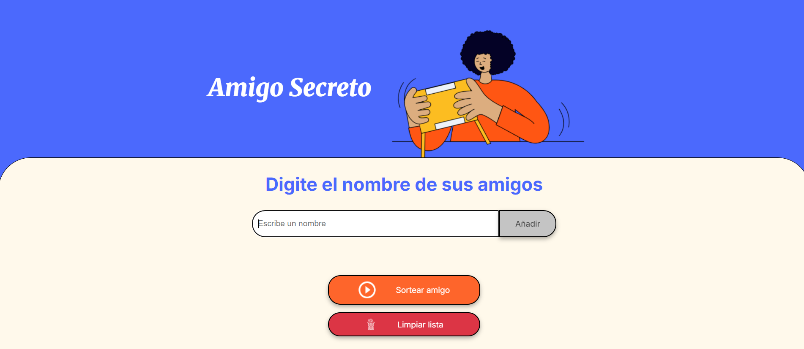
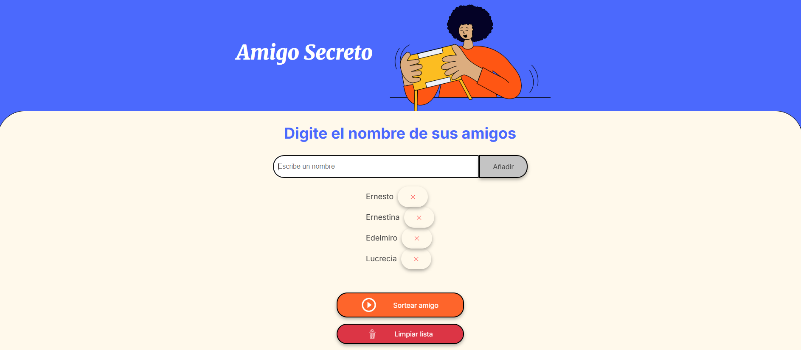
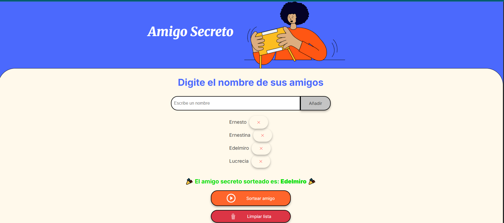

# 🎉 Amigo Secreto

Una aplicación web interactiva para organizar sorteos de amigo secreto de manera fácil y divertida.

## 📋 Descripción

**Amigo Secreto** es una aplicación web que permite a los usuarios crear una lista de participantes y realizar un sorteo aleatorio para determinar quién será el "amigo secreto". Es perfecta para organizar intercambios de regalos en oficinas, familias, grupos de amigos o cualquier evento especial.

## ✨ Características

- **Interfaz intuitiva**: Diseño limpio y fácil de usar
- **Gestión de participantes**: Agregar y eliminar nombres de la lista
- **Validación de datos**: Previene entradas vacías y nombres duplicados
- **Sorteo aleatorio**: Selección completamente aleatoria y justa
- **Experiencia mejorada**: Soporte para tecla Enter y enfoque automático
- **Responsive**: Funciona en dispositivos móviles y de escritorio
- **Sin dependencias**: JavaScript vanilla, sin frameworks externos

## 🚀 Demo

[Ver Demo en Vivo](https://javito72.github.io/challenge-amigo-secreto/)

## 🛠️ Tecnologías Utilizadas

- **HTML5**: Estructura semántica y accesible
- **CSS3**: Diseño responsive con variables CSS y Flexbox
- **JavaScript (ES6+)**: Lógica de la aplicación con funciones modernas
- **Google Fonts**: Tipografías Inter y Merriweather

## 📁 Estructura del Proyecto

```
amigo-secreto/
│
├── index.html          # Estructura principal de la aplicación
├── style.css           # Estilos y diseño responsive
├── app.js              # Lógica de la aplicación
├── assets/             # Recursos multimedia
│   ├── amigo-secreto.png
│   └── play_circle_outline.png
└── README.md           # Documentación del proyecto
```

## 🎮 Cómo Usar

1. **Agregar Participantes**:
   - Escribe el nombre de un participante en el campo de texto
   - Haz clic en "Añadir" o presiona Enter
   - El nombre aparecerá en la lista de participantes

2. **Gestionar Lista**:
   - Los nombres duplicados no se permiten
   - Puedes eliminar participantes haciendo clic en la "✕" junto a su nombre
   - La lista se actualiza automáticamente

3. **Realizar Sorteo**:
   - Haz clic en "Sortear amigo" cuando tengas al menos un participante
   - El sistema seleccionará aleatoriamente un ganador
   - El resultado se mostrará con una animación especial

## 💻 Instalación y Ejecución

### Opción 1: Clonar el repositorio
```bash
# Clonar el repositorio
git clone https://github.com/javito72/challenge-amigo-secreto

# Navegar al directorio
cd challenge-amigo-secreto

# Abrir index.html en tu navegador favorito
```

### Opción 2: Descargar ZIP
1. Descarga el archivo ZIP del repositorio
2. Extrae los archivos en tu directorio preferido
3. Abre `index.html` en cualquier navegador web moderno

### Opción 3: Ejecutar con servidor local
```bash
# Si tienes Python instalado
python -m http.server 8000

# Si tienes Node.js con live-server
npx live-server

# Si tienes PHP
php -S localhost:8000
```

## 🌐 Despliegue

El proyecto puede desplegarse fácilmente en:

- **GitHub Pages**: Ideal para proyectos estáticos
- **Netlify**: Despliegue automático desde Git
- **Vercel**: Deploy instantáneo con optimizaciones
- **Surge.sh**: Deploy rápido desde línea de comandos

### Ejemplo con GitHub Pages:
1. Sube el código a un repositorio de GitHub
2. Ve a Settings → Pages
3. Selecciona la rama main como fuente
4. Tu aplicación estará disponible en `https://github.com/javito72/challenge-amigo-secreto`

## 🔧 Funcionalidades Técnicas

### Validaciones Implementadas
- ✅ Campos vacíos
- ✅ Nombres duplicados
- ✅ Lista vacía antes del sorteo
- ✅ Caracteres especiales y espacios

### Algoritmo de Sorteo
```javascript
const indiceAleatorio = Math.floor(Math.random() * amigos.length);
const amigoSorteado = amigos[indiceAleatorio];
```

### Accesibilidad
- Uso de roles ARIA
- Labels descriptivos
- Navegación por teclado
- Anuncios para lectores de pantalla

## 🎨 Personalización

### Cambiar Colores
Modifica las variables CSS en `style.css`:
```css
:root {
    --color-primary: #4B69FD;    /* Color principal */
    --color-secondary: #FFF9EB;  /* Color de fondo */
    --color-button: #fe652b;     /* Color de botones */
}
```

### Agregar Nuevas Funciones
El código está estructurado para fácil extensión:
- Función para exportar resultados
- Historial de sorteos
- Múltiples listas de participantes
- Configuraciones personalizadas

## 🤝 Contribuciones

¡Las contribuciones son bienvenidas! Si quieres mejorar el proyecto:

1. Fork el repositorio
2. Crea una rama para tu feature (`git checkout -b feature/nueva-funcionalidad`)
3. Commit tus cambios (`git commit -m 'Agregar nueva funcionalidad'`)
4. Push a la rama (`git push origin feature/nueva-funcionalidad`)
5. Abre un Pull Request

### Ideas para Contribuir
- 🌍 Internacionalización (múltiples idiomas)
- 📱 PWA (Progressive Web App)
- 🎵 Efectos de sonido
- 📊 Estadísticas de sorteos
- 💾 Persistencia de datos local
- 🎨 Temas personalizables


## 👨‍💻 Autor

**Christian Javier Lemos** - *Desarrollador Full Stack*

- GitHub: [@javito72](https://github.com/javito72)
- LinkedIn: [christian-javier-lemos](https://www.linkedin.com/in/christian-javier-lemos)

## 🙏 Agradecimientos

- Inspirado en el clásico juego de amigo secreto
- Diseño basado en principios de UX/UI modernos
- Comunidad de desarrolladores por feedback y sugerencias

## 📞 Soporte

Si encuentras algún bug o tienes sugerencias:

1. Abre un [Issue](../../issues) en GitHub
2. Describe detalladamente el problema
3. Incluye pasos para reproducir el error
4. Especifica tu navegador y sistema operativo

---

⭐ Si te gusta este proyecto, ¡dale una estrella en GitHub!

## 📱 Capturas de Pantalla

### Pantalla Principal


### Lista de Participantes


### Resultado del Sorteo


## 🔄 Changelog

### v1.0.0 (02-08-2025)
- ✅ Funcionalidad básica de sorteo
- ✅ Interfaz responsive
- ✅ Validaciones de entrada
- ✅ Gestión de participantes

### Próximas Versiones
- 🔄 v1.1.0: Persistencia de datos
- 🔄 v1.2.0: Múltiples sorteos
- 🔄 v1.3.0: Exportar resultados